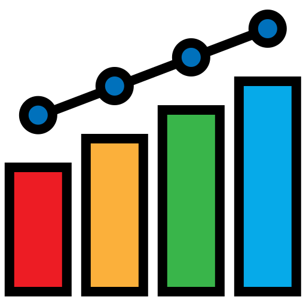

<h1 align="center">

<h1 align="center">
  
  Uni-SLAM:

  Uncertainty-Aware Neural Implicit SLAM for Real-Time Dense Indoor Scene Reconstruction
</h1>


### [Project Page](https://shaoxiang777.github.io/project/uni-slam/) | [Paper](https://openaccess.thecvf.com/content/WACV2025/html/Wang_Uni-SLAM_Uncertainty-Aware_Neural_Implicit_SLAM_for_Real-Time_Dense_Indoor_Scene_WACV_2025_paper.html)

> [Shaoxiang Wang](https://shaoxiang777.github.io/),
  [Yaxu Xie](https://scholar.google.com/citations?user=3ZKuh9EAAAAJ&hl=en),
  [Chun-Peng Chang](https://chunpeng-chang.github.io/),
  [Christen Millerdurai](https://scholar.google.com/citations?user=8p9OOd0AAAAJ&hl=en&oi=sra),
  [Alain Pagani](https://av.dfki.de/members/pagani/),
  [Didier Stricker](https://av.dfki.de/members/stricker/)<br />
> WACV 2025

</h1>

<p align="center">
  <a href="">
    
  </a>
</p>

<br>

## Installation

Please set up the project by following the instructions below.

```bash
git clone git@github.com:dfki-av/Uni-SLAM.git
cd Uni-SLAM
```

```bash
# Create conda environment
conda create -n unislam python=3.8
conda activate unislam

# Install all the dependencies via pip
pip install -r requirements.txt
```

## Run

### Replica
Download the data as below and the data is saved into the `./Datasets/Replica` folder.
```bash
bash scripts/download_replica.sh
```
and you can run unislam:
```bash
python -W ignore run.py configs/Replica/room0.yaml
```
The mesh for evaluation is saved as `$OUTPUT_FOLDER/mesh/final_mesh_eval_rec_culled.ply`, where the unseen and occluded regions are culled using all frames.


### ScanNet
Please follow the data downloading procedure on [ScanNet](http://www.scan-net.org/) website, and extract color/depth frames from the `.sens` file using this [code](https://github.com/ScanNet/ScanNet/blob/master/SensReader/python/reader.py).

Once the data is downloaded and set up properly, you can run unislam:
```bash
python -W ignore run.py configs/ScanNet/scene0000.yaml
```
The final mesh is saved as `$OUTPUT_FOLDER/mesh/final_mesh_culled.ply`.

### TUM RGB-D
Download the data as below and the data is saved into the `./Datasets/TUM` folder.
```bash
bash scripts/download_tum.sh
```
and you can run unislam:
```bash
python -W ignore run.py configs/TUM_RGBD/freiburg1_desk.yaml
```
The final mesh is saved as `$OUTPUT_FOLDER/mesh/final_mesh_culled.ply`.

## Evaluation

### Average Trajectory Error
To evaluate the average trajectory error. Run the command below with the corresponding config file:
```bash
# An example for room0 of Replica
python src/tools/eval_ate.py configs/Replica/room0.yaml
```
Uncertainty bar and activated mapping bar are also visualized here.

### Reconstruction Error
To evaluate the reconstruction error, first download the ground truth Replica meshes. Those meshes are already culled by `cull_mesh.py` accoding to gt camera pose, to remove unseen and occluded area.

```bash
bash scripts/download_replica_mesh.sh
```

Then run the command below. The 2D metric requires rendering of 100 depth images, which will take some time. Use `-2d` to enable 2D metric. Use `-3d` to enable 3D metric. To evaluate the accuracy of the reconstructed mesh, you can measure the completion ratio under different distance thresholds (e.g., 1 cm, 3 cm, 5 cm, etc.).
```bash
# An example for room0 of Replica
OUTPUT_FOLDER=output/Replica/room0
GT_MESH=Datasets/Replica/cull_replica_mesh/room0_mesh_culled.ply
python src/tools/eval_recon.py --rec_mesh $OUTPUT_FOLDER/mesh/final_mesh_eval_rec_culled.ply --gt_mesh $GT_MESH -2d -3d
```

## Visualizing UNISLAM Results
For visualizing the results, we recommend to set `mesh_freq: 50` in [configs/UNISLAM.yaml](configs/UNISLAM.yaml) and run unislam from scratch.

After unislam is trained, run the following command for visualization.

```bash
python visualizer.py configs/Replica/room0.yaml --output output/Replica/room0 --top_view --save_rendering
```
The green trajectory indicates the ground truth trajectory, and the red one is the trajectory of unislam.

Note: `mesh_freq: 50` means extracting a mesh every 50 input frames. Since extracting a mesh with a high resolution (*e.g.*, 1 cm). takes some time, for faster running of unislam for visualization set `meshing resolution` in [configs/Replica/replica.yaml](configs/Replica/replica.yaml) to a higher value before running unislam (*e.g.*, 5 cm).


## Related Repositories
We would like to extend our gratitude to the authors of [ESLAM](https://github.com/idiap/ESLAM) and [NICE-SLAM](https://github.com/cvg/nice-slam) for their exceptional work. Their code served as a valuable foundation for our own project, and we are appreciative of the
effort they put into their work.

## Contact
You can contact the author through email: shaoxiang.wang@dfki.de.

## Citing
If you find our work useful, please consider citing:
```BibTeX
@inproceedings{wang2025uni,
      title={Uni-slam: Uncertainty-aware neural implicit slam for real-time dense indoor scene reconstruction},
      author={Wang, Shaoxiang and Xie, Yaxu and Chang, Chun-Peng and Millerdurai, Christen and Pagani, Alain and Stricker, Didier},
      booktitle={2025 IEEE/CVF Winter Conference on Applications of Computer Vision (WACV)},
      pages={2228--2239},
      year={2025},
      organization={IEEE}
    }
```

### Acknowledgement
This research has been partially funded by the EU projects CORTEX2 (GA Nr 101070192) and FLUENTLY (GA Nr 101058680).